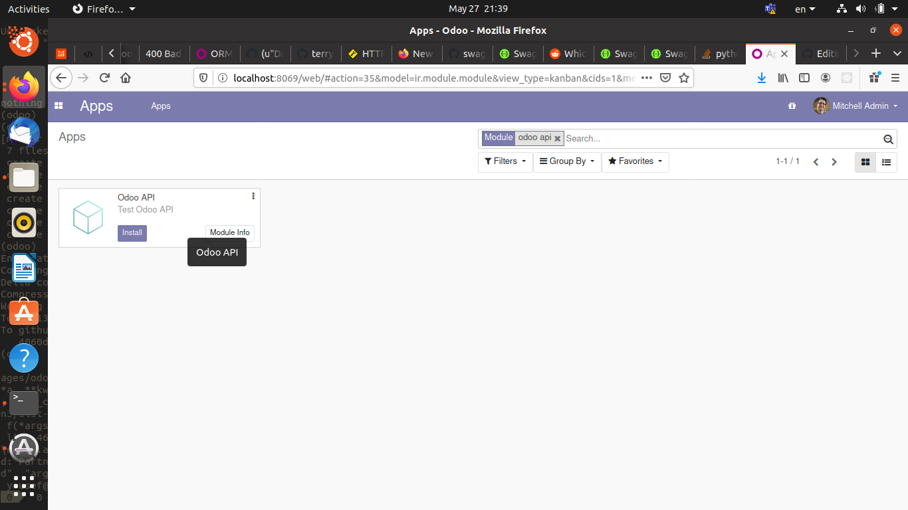
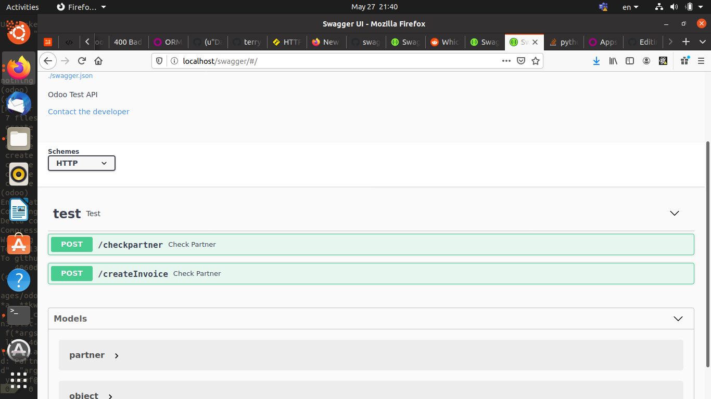

# odoo-test-api
Odoo Test API

init project

start services with docker

`docker-compose up -d`

go to `http://localhost:8069`

create database and install odoo api test

go to `http://localhost/swagger`

give it a try

stop services

`docker-compose down -v`

